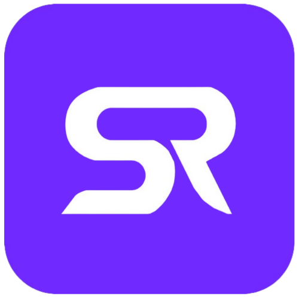

# Social Repo - Project Details

## Project Overview

**Social Repo** is a browser extension which simplify your process of filling out forms and applications by storing users' social media profile links.

All the details regarding the project are listed here.
If you are here, you might be interested in contributing to the project. 🎉

You can go through the following sections to get an idea about the project and then read the [contribution guidelines](CONTRIBUTING) to get started.

## Table of Contents

1. [Features](#features)
2. [UI](#ui)
    - [Design](#design)
    - [Logo](#logo)
    - [Color Theme](#color-theme)
3. [Tech Stack](#tech-stack)
    - [Code Structure](#code-structure)
        - [Code Guidelines](#code-guidelines)
        - [Chrome](#chrome)
4. [Social links data](#social-links-data)

## Features

<!-- As seen in [layout](#full-layout), the features are as follows: -->

1. **Draggable containers**: Users can rearrange the social media containers in edit menu by dragging and dropping based on their preference.
2. **Info button**: Info button for the _Attribution_ of Codebase and contributors.
3. **Edit button**: Users can click on edit button, which will open a edit menu where they can update their social handles.
    - There can be a search bar, in which users can search for the social media handle they want to update.
4. **Save button**: Under edit menu, there will be a save button which will save the updated social media handles.
5. **Social media containers**: Containers of icons should be clickable and should copy the social handle URL link to clipboard.
    - It should show a confirmation that the link has been copied.
    - It should also paste the link in the **focused** input field.
    - There can be preview button which will open the respective social media profile in a new tab.
6. **Command Prefix**: Users can use a command which can replace the social media handle with the respective URL link.
    - For example, if user types `\twitter`, it should replace with `https://twitter.com/username`.
    - This feature can be enabled/disabled under edit menu.
    - Also the prefix can be changed.
    - It should only works for input & textarea fields.

> Additional features or change in features are welcome by raising issue. 🤗

## UI

### Design

#### Front panel


#### Full layout


### Logo

Logo is completed!

_Contributed by [Shreya Porwal](https://github.com/porwalshreyaa)_



### Color Theme

[Color Palette](https://coolors.co/ffffff-9662ff-8c52ff-7029ff)

-   **Primary Color**: `#7029FF`
-   **Secondary Color**: `#B58FFF`;
-   **Text Color**: `#FFFFFF`
-   **Text Color 2**: `#242327`

_A secondary color is yet to be finalized_.

## Tech Stack

-   HTML
-   CSS
-   JavaScript

### Code Structure

#### Code Guidelines

-   All the **HTML** code should be in [`index.html`](../../src/code/index.html) file only.
-   All the **CSS** code should be in [`style.css`](../../src/code/style.css) file only.
-   All the **JavaScript** code should be in [`index.js`](../../src/code/index.js) file only.
-   Make sure to follow the code structure and naming conventions.
-   Write well documented code and follow the best practices.
-   Use Semantic HTML elements and CSS classes, i.e. _avoid using divs for everything_.

#### Chrome

```
SocialRepo/
├── src/
│   ├── assets/
│   │   ├── logos/
│   │   │   ├── <social_media_icon.png>     # Social media icons
│   │   ├── logo.png                        # Logo of the project - 16x16
│   │   ├── logo.png                        # Logo of the project - 32x32
│   │   ├── logo.png                        # Logo of the project - 48x48
│   │   ├── logo.png                        # Logo of the project - 128x128
│   │   └── logo.png                        # Logo of the project - 500x500
│   ├── code/
│   │   ├── index.html
│   │   ├── index.js
│   │   ├── style.css
│   ├── manifest.json                      # Manifest file for browser extension
└───└── social-links.json                   # Social media handle url
```

## Social links data

We need all major social media profile URLs and their respective icons.

-   All the social media media profile URLs should be stored in [`social-links.json`](../../src/social-links.json) file.
    **Preview**:
    ```json
    {
        "social_media_name": "link",
        "linkedin": "https://www.linkedin.com/in/<username>",
        "github": "https://www.github.com/<username>",
        "medium": "https://<username>.medium.com"
    }
    ```
    -   The `<username>` will be replaced by the user's social media handle.
-   After adding the social media profile URL, please update the [social-apps.md](./social-apps.md) file.
    **Example**:
    If you have added the `twitter` social media profile URL, then:
    -   add `x` inside the brackets of `- [ ] Twitter`.
        _If the `twitter` social media profile name is **not** present in the list, then:_
    -   Add `- [x] Twitter` in the list.
-   All the icons should be stored in [`logos`](../../src/assets/logos/) folder.
-   Icons should be of minimum `128x128` and maximum `256x256` resolution.
-   Icons must be in `png` format and transparent background.
-   Icons should be named as `social-media-name.png` (e.g. `twitter.png`, `github.png`, `instagram.png`, etc...).
